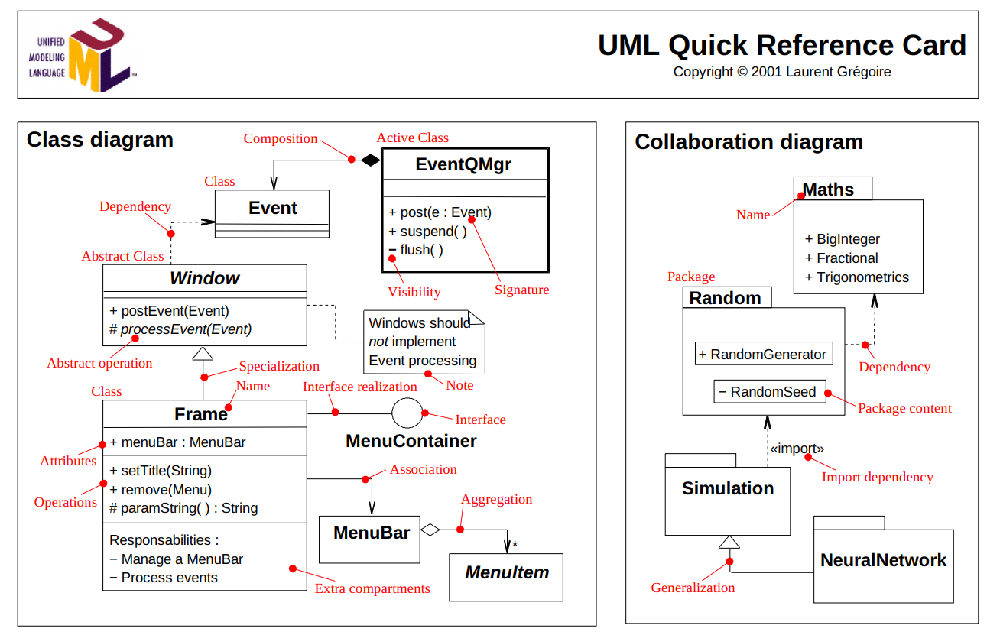

# Assignment 2: Answers

**Complete this document, commit your changes to Github and submit the repository URL to Canvas.** Keep your answers short and precise.

Your Name: Ria Mukherji

Used free extension: [ ] 24 hrs or [ ] 48 hrs

[X] Early submission (48 hrs) YES SUBMITTED EARLY

[ ] Bonus work. Describe: ... 

Place [x] for what applies.

## UML Diagram

Add your UML class diagram here.

Replace the following image with your diagram. You can draw it by hand and take a photo.

## Answers

1. How do you train the model and how do you classify a new tweet? Give a short description of the main steps.
 
    > For training the model I implement a while loop to read in the training data set while there are still lines to read. Using a char array as a buffer, I seperate the csv file and keep only the sentiment of the tweet and the tweet itself. I classify a new tweet just based on its location in the file, and I take it and store it as a DSString. I then tokenize the tweet and store each individual word from it into a vector using my function from DSString. I then index through all the words in the tweet associated with the sentiment from the tweet and make all the letters lowercase. This prevents my map from storing duplicate words just because they have different capitalization. If the sentiment is 0 or 4 all of the tweets get added into my map (if they are not already there, the map checks this itself). The second declared key/part of my map is an integer and if the sentiment is 4 it gets one added and if its 0 it gets one subtracted. This is how I get all my words stored and tell if they are positive or not.

2. How long did your code take for training and what is the time complexity of your training implementation (Big-Oh notation)? Remember that training includes reading the tweets, breaking it into words, counting, ... Explain why you get this complexity (e.g., what does `N` stand for and how do your data structures/algorithms affect the complexity).

   > My training function time is around 0.743663 this should print to the console. It has a time complexity of O(NMlogK). N is the input size. The imput of my function is just all the lines in one file. There one for loop that goes through the file for each line representing N. M is the average number of tokens in each tweet from N which I have to go through when tokenizing for each line which is how I got NM. Then it has to go through the ordered map and compare words to make sure they dont already exist which I googled the time complexity for that is logK.Apparently using an unordered map would reduce my time complexity, but I used an ordered one so total my time complexity is O(NMlogK)

3. How long did your code take for classification and what is the time complexity of your classification implementation (Big-Oh notation)? Explain why.

   >  My testing function time is around 8.14738 seconds this should print to the console. The complexity is O(N^2). The first loop is O(NM) because it goes through each line and does the tokenizing just like before, but because the most deeply nested for loop or dominant factor is my loop that runs through ids (N times) and iterates each line also (N times). This results in O(N^2 
+ NM) and N^2 is dominating resulting in O(N^2)

4. How do you know that you use proper memory management? I.e., how do you know that you do not have
   a memory leak?

   > I deleted everything allocated on the heap! Also I ran valgrind and it said no leaks for both sentiment and DSString executables.
   Also important note my valgrind on sentiment literally takes FOREVER to run but it works and says all dynamically allocated heaps freed I have a png of this included.

5. What was the most challenging part of the assignment?

   >  If I had to choose one thing, it would be getting started on DSString because I wasn't sure what to do. The file input was kind of rough too which sounds REALLY dumb lol, but I didn't really know how to do the copy and paste thing into the command prompt so I was struggling. Also DSString was a little rough because I was confused and had no clue what I was doing. Once I started then everything else like training and testing was pretty easy. One other thing that was hard was drawing the UML diagram before coding because I am not amazing at planning this stuff out. I actually enjoyed this project a lot and I like maps so much they are pretty cool. If Adam or Jadon are reading this thanks so much for all the help :D